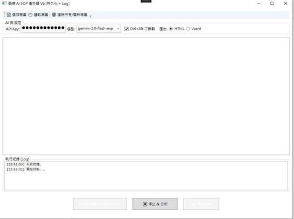

# 📖 AutoSopCreator (Open Source Edition)
## AI 賦能的自動化 SOP 標準作業程序生成器

### 🌟 專案簡介 (Introduction)
**AutoSopCreator** 是一款基於 C# WPF 開發的 Windows 桌面應用程式，旨在解決工程師、PM 與技術寫手撰寫操作手冊的痛點。它就像是坐在您身旁的 AI 助理，「看著您操作，並自動幫您寫好圖文並茂的文件」。

本專案 (**V5**) 為 **完全開源版本**，核心理念是「輕量」與「無授權負擔」。我們移除了所有付費組件，採用 **NPOI 引擎**，讓您無需安裝 Office、無需購買任何元件授權，即可生成標準的 Word (.docx) 文件。

> ****
> *圖 1：簡潔直觀的操作介面，專注於快速產出*

---

### ✨ 核心功能 (Core Features)

我們重新定義了螢幕錄製的體驗，讓「寫文件」這件事變得跟「做一遍」一樣簡單。

#### 1. 🎯 意圖導向的精準錄製 (Intent-Based Recording)
傳統錄製軟體往往會錄下太多無意義的滑鼠軌跡。我們採用了「意圖觸發」機制：
* **智慧過濾**：僅在您按下 `Ctrl + Alt + 左鍵` 時才觸發錄製。
* **區域截圖 (Snipping)**：支援十字游標框選，讓您直接針對按鈕或選單進行特寫，排除螢幕雜訊。

#### 2. 🖍️ 視覺化標註 (Visual Annotation)
截圖後自動彈出編輯視窗，讓重點一目了然。
* **所見即所得**：截圖後立即繪製紅框。
* **多重標記**：支援在同一張圖上繪製多個紅框，標示複雜的操作順序。

#### 3. 🤖 Gemini AI 自動撰寫 (AI-Powered)
內建 Google Gemini Vision AI 整合介面。
* **看圖說故事**：AI 會分析您的圖片內容與紅框位置，自動生成專業的操作步驟說明。
* **一鍵重寫**：不滿意 AI 的文筆？點擊重寫或手動微調，讓文字更精確。

#### 4. 📄 100% 免費文件匯出 (License-Free)
* **Word (.docx)**：使用 NPOI 引擎，產出格式整齊的標準文件。
* **HTML**：生成單一網頁檔，圖片內嵌，方便 Email 傳送或內網分享。

---

### 📊 版本差異比較 (Version Comparison)

**AutoSopCreator V5 (開源版)** 已經能滿足絕大多數「即錄即用」的短篇教學需求。
若您是專業技術寫手，需要**專案存檔**或**分段錄製**，可參考 V7 專家版。

| 功能特色 | 🟢 V5 開源版 (Open Source) | 👑 V7 專家版 (Pro) |
| :--- | :---: | :---: |
| **適用對象** | 開發者、單次短篇教學 | 專業寫手、大型專案維護 |
| **基礎錄製與截圖** | ✅ | ✅ |
| **AI 智慧圖文生成** | ✅ | ✅ |
| **Word/HTML 匯出** | ✅ | ✅ |
| **專案存檔 (.sop)** | ❌ (關閉即清除) | **✅ (永久保存、隨時編輯)** |
| **中斷續錄功能** | ❌ (需一次錄完) | **✅ (支援累加錄製)** |
| **AI 節費優化引擎** | ❌ | **✅ (跳過已分析步驟)** |
| **完整操作日誌** | ❌ | **✅ (除錯與狀態監控)** |

---

### 💡 關於 V7 專家版 (Pro Version)
如果您在工作中經常遇到「錄到一半需要下班，但無法存檔」或「需要維護長篇手冊」的情況，V7 Pro 版本將是您的最佳助手。它解決了資料持久化的問題，讓您的工作成果得以保存與延續。

👉 **了解更多 V7 Pro 詳情與獲取方式：**
[**酷意 AI 平台 (Cool Idea AI Platform)**](http://ourcoolidea.com)

---

### 🤝 貢獻與授權 (License)

本專案採用 **[MIT License](LICENSE)** 授權。
這意味著您可以免費使用、修改與分發本軟體，無論是用於個人學習或商業用途。

**Developed by Joseph**
* 🌐 Website: [http://ourcoolidea.com](http://ourcoolidea.com)
* 📧 Contact: (pigqig@gmail.com)

*如果您覺得這個工具有幫助，歡迎給我們一顆星 ⭐️！*
